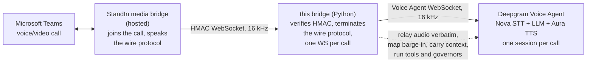
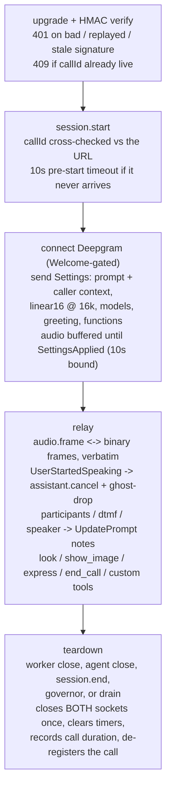

The bridge is a small, stateless-per-call relay. It holds two WebSockets per call - the StandIn media bridge on one side, a Deepgram Voice Agent session on the other - and mostly copies bytes between them.

## System overview

The StandIn media bridge handles everything about Teams itself and exposes each call as a single WebSocket carrying `audio.frame` (PCM 16 kHz), `video.frame` (JPEG) and control messages. This bridge has no idea what is on the other end of the Teams call - it only speaks the wire protocol.

## The copy-only property

The StandIn wire is base64 **PCM 16 kHz, 16-bit, mono**. The Voice Agent session is pinned to `linear16` at 16 kHz both ways (`container: none`), so the hot path is **copy-only**: caller audio is base64-decoded into a binary frame, agent audio is base64-encoded onto the wire. No resampling, no re-encoding, nothing added to the latency budget beyond a relay hop. This matches the strictly transcode-free ElevenLabs sibling (the OpenAI sibling, by contrast, must resample to 24 kHz).

## Call lifecycle

Two ordering contracts are enforced on the Deepgram side: the `Settings` message is only sent after the server's `Welcome`, and **no caller audio flows until the server acks with `SettingsApplied`** (buffered up to ~5 s, bounded, then flushed oldest-first; a 10 s ack timeout ends the call rather than leaving it silent).

Barge-in: on `UserStartedSpeaking` the Voice Agent stops generating server-side; the bridge mirrors the cut to the Teams side with `assistant.cancel` and ghost-drops frames still in flight until the agent audibly starts its next utterance (`AgentStartedSpeaking`) - a state flag, so it cannot leak memory no matter how often the caller barges in.

## Source module map

| Module | Responsibility |
|---|---|
| `server.py` | aiohttp server + WS upgrade, HMAC validation, connection guards (caps, replay, pre-start, dup-callId 409), session registry, tool registry wiring, graceful drain |
| `session.py` | One call: the StandIn WS ⇄ Voice Agent WS relay, SettingsApplied gate, ghost-drop, governors, goodbye, tool dispatch (built-in + custom), context notes, vision buffering |
| `deepgram.py` | Voice Agent socket (Welcome gate, KeepAlive, binary audio framing), Settings/prompt builders, function schemas, Aura TTS for the goodbye |
| `protocol.py` | Wire message parsing (JSON, camelCase, discriminated on `type`) + PCM duration helper |
| `hmac_auth.py` | `HMAC-SHA256("{timestampMs}.{callId}")` sign/verify (constant-time), header names, freshness |
| `ssrf.py` | Public-URL guard for the agent-supplied `show_image` fetch (one re-validated redirect hop) |
| `vision.py` | Describe-then-answer vision hook (OpenAI-compatible endpoint) |
| `config.py` | Env config, fail-loud numeric parsing, `*.deepgram.com` allowlists, think-endpoint and vision-URL validation |
| `cli.py` | CLI entry point, `.env` loader, SIGTERM/SIGINT drain, friendly startup errors |
| `log.py` / `metrics.py` | Minimal leveled logger; Prometheus counters + call-duration histogram |

## Trust and security model

| Layer | Protection |
|---|---|
| Upgrade auth | `HMAC-SHA256("{timestampMs}.{callId}")`, constant-time compare, fails closed when the secret is unset |
| Replay | Single-use `(callId, ts, sig)` guard within a 60 s freshness window |
| Duplicate call | A second live connection for the same `callId` is rejected (`409`) - no second billed agent session |
| DoS | Max connections (64), per-IP cap (default = total cap), 2 MB inbound frame cap, 1 MB outbound backpressure cap (hot-path audio only - control frames, one-shot images and goodbye audio always pass), 10 s pre-start timeout, 90 s dead-peer window |
| Key hygiene | `DEEPGRAM_API_KEY` is server-side only, never sent to the Teams side; both Deepgram hosts are pinned to `*.deepgram.com` so the key cannot be exfiltrated to another host |
| SSRF | The agent-supplied `show_image` URL is resolved to public hosts only, connect-time DNS pinned against rebind, at most one re-validated redirect, bounded time and size |
| Tool bounds | Agent-supplied strings relayed to the worker are length-capped; unknown tools get an error result, never a crash |
| Crash safety | Every async entry point is guarded so a single malformed frame or throwing handler cannot take the process down |
| Shutdown | The CLI's signal drain (or your `server.close()`) ends live calls (`session.end` + close), letting an in-progress goodbye finish first |
