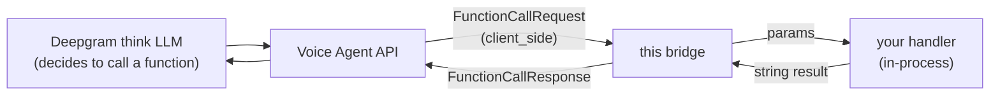

The four built-in tools are just the default registry. The Voice Agent API's function calling **is** its plugin mechanism, and the bridge exposes it via a tool registry.



## Client-side vs. server-side functions

Deepgram's Voice Agent API knows two kinds of functions, chosen by whether the schema declares an `endpoint`:

- **Client-side** (no endpoint) - Deepgram sends a `FunctionCallRequest` back over the socket and waits for your `FunctionCallResponse`. This is what the bridge registers and executes; it is the right model for telephony tools that touch private backends inside your trust boundary.
- **Server-side** (with an `endpoint.url`) - Deepgram calls your HTTP endpoint directly. The bridge does not intercept these; if you need one, declare it in your own `Settings` customization. The bridge only answers `client_side` calls.

## Custom function tools (the bridge executes them)

Register a name, a JSON schema and a handler; the bridge declares the schema in every session's `Settings`, and when the agent calls the function, your handler runs **in your process** and its returned string goes back as the result. A thrown error becomes an error result the model can recover from - it never crashes the call.

```python
from deepgram_msteams_bridge import CustomTool, load_config, start_server

async def lookup_order(params: dict, ctx) -> str:
    ctx.log.info(f"lookup_order {params.get('orderNumber')}")
    return await crm.order_status(str(params.get("orderNumber")))  # the agent speaks this

def transfer_call(params: dict, ctx) -> str:
    notify_human_queue(ctx.call_id)
    return "A colleague has been notified and will join shortly. Let the caller know."

tools = [
    CustomTool(
        name="lookup_order",
        description="Look up the status of a customer order by its order number.",
        parameters={
            "type": "object",
            "properties": {"orderNumber": {"type": "string", "description": "e.g. KO-1234"}},
            "required": ["orderNumber"],
        },
        handler=lookup_order,
    ),
    CustomTool(
        name="transfer_call",
        description="Offer to transfer the caller to a human. Call when the caller asks for a person.",
        handler=transfer_call,
    ),
]

server = await start_server(load_config(), tools=tools)
```

Handlers may be sync or async. The handler context carries per-call state: `CustomToolContext(call_id, participant_count, recording_active, log)`.

Rules and behavior:

- **Names must not collide** with the built-ins (`end_call`, `express`, `show_image`, `look`); collisions and duplicate names fail at startup, not mid-call.
- **Return a string** - it is the agent's function result, so write it the way you would brief the agent ("Order KO-1 shipped yesterday", not raw JSON dumps unless the model should read structure).
- **Keep handlers fast.** The agent (and the caller) waits on the result. Enforce your own timeout for slow backends and return a graceful failure string.

The [example project](https://github.com/komaa-com/deepgram-msteams-bridge-py/tree/main/examples/basic-bridge) ships a runnable `lookup_order` registration.

## Why in-process rather than a marketplace

Telephony tools (`lookup_order`, `transfer_call`, `check_crm`) usually hit private backends inside a customer's trust boundary, and on a voice call the caller is waiting in silence - so an in-process handler (zero extra network hops, credentials never leave your process) is the right execution model, not a public registry of HTTP plugins. The extensibility surface here is distribution, not routing: you can package a handler as your own PyPI module and pass it to `start_server(..., tools=[...])`.
